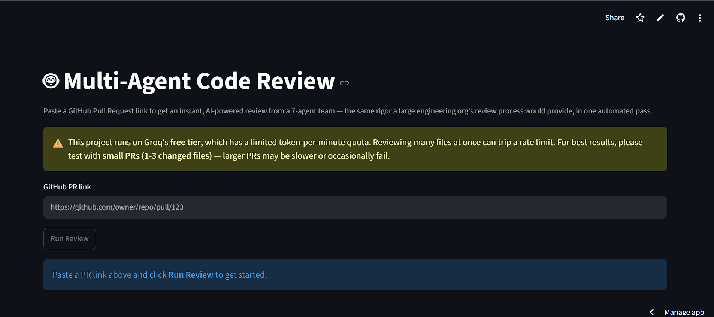

# DiffReview — Multi-Agent AI Code Review System

> A multi-agent AI system that replicates a full engineering review team, giving solo developers and small startups the same level of code review rigor that only large companies with dedicated departments can normally afford.

**Status:** ✅ Complete and deployed. Paste a GitHub PR link and get a full, AI-generated review in your browser.

**🔴 Live Demo:** [https://diffreview.streamlit.app/](https://diffreview.streamlit.app/)

**📦 Repository:** [https://github.com/amir-ali-asif/DiffReview/](https://github.com/amir-ali-asif/DiffReview/)



---

## Problem Statement

In large engineering organizations, code review is distributed across specialized teams — one team focuses on correctness and QA, another on security, another on code quality standards, with additional roles covering test coverage, documentation, performance, and dependency management.

Solo developers and small startup teams don't have this luxury. A single person is responsible for catching everything, which routinely results in overlooked bugs, unnoticed security vulnerabilities, and code quality that erodes over time simply because there isn't the bandwidth to enforce consistent standards.

DiffReview addresses this by acting as a full, always-available review team — reviewing GitHub Pull Requests with the rigor of a large organization's multi-department process, condensed into a single automated pass.

---

## How It Works

```
                              ┌─────────────────────────┐
                              │   Streamlit Frontend      │  Streamlit Community Cloud
                              │   (paste PR link, click   │
                              │    "Run Review")          │
                              └────────────┬─────────────┘
                                           │ HTTPS POST /review
                                           ↓
                              ┌─────────────────────────┐
                              │   FastAPI Backend          │  Render
                              │   (error handling, Groq→   │
                              │    Gemini fallback)        │
                              └────────────┬─────────────┘
                                           ↓
                    PyGithub fetches diff + old code + new code
                                           ↓
                    Filter: Python files → agents | non-Python → skipped list
                                           ↓
   ┌────────────────────────────────────────┐
   │   7 Specialist Agents (run in parallel)   │
   │  1. Bug-Hunter Agent                       │
   │  2. Security Agent*                        │
   │  3. Style/Readability Agent                │
   │  4. Test Coverage Agent                    │
   │  5. Documentation Agent                    │
   │  6. Performance Agent                      │
   │  7. Dependency/License Agent†               │
   └────────────────┬─────────────────────────┘
                     ↓
              Coordinator Agent
   (deduplicates, prioritizes by severity, writes final verdict)
                     ↓
         Final Report → returned to the Streamlit UI
         + full reasoning trace in LangSmith
```
*Security also scans all changed files, regardless of language, for leaked secrets/credentials.*
†*Dependency only runs on manifest files (requirements.txt, Pipfile, etc.), which are never Python files.*

Each specialist agent pairs a **real, industry-standard static analysis tool** with **LLM reasoning**, which turns the tool's raw, technical output into a clear, actionable explanation. This is not "prompting an LLM to look at code" — every finding is grounded in the output of a genuine analysis tool; the LLM's role is limited to interpretation and communication, not detection.

---

## The 8 Agents at a Glance

| # | Agent | Paired Tool | Key Design Detail |
|---|---|---|---|
| 1 | Bug-Hunter | `pylint` + `flake8` | The template agent — establishes the tool → LLM pattern every other agent follows |
| 2 | Security | `bandit` + a custom secret/credential scanner | The secret scanner uses deterministic pattern matching rather than LLM judgment, since a missed leaked credential is too costly to leave to inference |
| 3 | Style / Readability | `pylint` (convention/refactor checks) + `black --check` | Scoped to a narrower set of checks to avoid overlapping with Bug-Hunter's findings |
| 4 | Test Coverage | Python `ast` heuristic + a self-contained `pytest`/`coverage.py` run | Explicitly and honestly scoped: it can only see the single changed file, not a project's full test suite |
| 5 | Documentation | Custom `ast`-based docstring analysis | The only agent with no external CLI dependency; evaluates both missing and low-quality docstrings |
| 6 | Performance | `radon` (cyclomatic complexity + maintainability index) | Instructed to reason beyond radon's structural score, since some real inefficiencies (e.g. quadratic string concatenation) don't register as "complex" |
| 7 | Dependency / License | `pip-audit` | Scoped to dependency manifest files only; also flags unpinned dependencies that `pip-audit` itself cannot evaluate |
| — | **Coordinator** | *(no external tool — pure LLM reasoning)* | Deduplicates overlapping findings across all 7 reports, prioritizes by real severity, and produces one final verdict |

---

## Automated Evaluation Framework

Agent quality is measured, not assumed. Two purpose-built evaluation harnesses are included:

**`eval_runner.py`** — evaluates the 7 specialist agents against a library of hand-authored fixture cases (an obvious issue, a subtle issue, and a clean-code control case per agent), with grading performed by a separate LLM-as-judge call. Supports multi-run reliability checking (`--runs 3`) to account for LLM non-determinism, flagging any case where repeated runs disagree as "flaky" rather than trusting a single sample.

**`eval_coordinator.py`** — a separate harness for the Coordinator, since its input (pre-written mock reports) and the properties worth verifying (deduplication accuracy, correct severity ordering, resistance to hallucinated findings, correct handling of skipped files) differ fundamentally from the specialist agents' code-analysis grading.

---

## Reliability: Surviving Two Live Model Deprecations

This system's resilience was tested for real, not just designed in theory. During development:

- **Groq deprecated the original primary model** (`llama-3.3-70b-versatile`) mid-build. The system recovered by migrating to Groq's recommended replacement and, separately, by relying on its existing Gemini fallback path as a safety net.
- **Google subsequently deprecated the original Gemini fallback model** as well. The fallback path was updated in a single shared module (`llm_client.py`), requiring no changes to any of the 8 individual agent files — a direct benefit of routing every agent's LLM calls through one centralized client rather than duplicating provider logic across files.
- **A Windows-specific encoding bug** was identified and fixed during testing: temporary files written for static analysis tools did not explicitly declare UTF-8 encoding, causing failures on Windows when reviewed code contained a byte-order-mark or certain Unicode characters. All temporary file writes across the agent codebase now explicitly specify `encoding="utf-8"`.
- **Rate-limit handling was hardened** with automatic retry-with-backoff (parsing the exact wait time from Groq's own rate-limit error) and a concurrency limiter capping simultaneous LLM requests, since all 7 agents run in parallel and can otherwise burst past a free-tier quota simultaneously.

---

## Deployment Architecture

| Component | Platform |
|---|---|
| Frontend (Streamlit) | Streamlit Community Cloud |
| Backend (FastAPI) | Render (free tier) |

The frontend and backend are deployed independently and communicate exclusively over HTTPS; the frontend never calls GitHub, Groq, or Gemini directly. Cross-origin requests are explicitly permitted via CORS middleware on the backend, and the backend binds to a dynamically assigned port as required by the hosting platform. Secrets (API keys) are configured directly in Render's environment; the frontend requires only the backend's public URL, configured via Streamlit Community Cloud's secrets management.

---

## Tech Stack

| Layer | Tool |
|---|---|
| Agent Orchestration | LangGraph |
| LLM | Groq API (`openai/gpt-oss-120b`), with automatic Gemini (`gemini-3.6-flash`) fallback |
| Code Parsing | Python `ast` module |
| PR Fetching | PyGithub |
| Static Analysis | `pylint`, `flake8`, `bandit`, `coverage.py`, `black`, `pytest`, `radon`, `pip-audit` |
| Backend | FastAPI |
| Frontend | Streamlit |
| Observability | LangSmith |
| Evaluation | Two custom fixture-based, LLM-as-judge harnesses with multi-run reliability checking |
| Hosting | Streamlit Community Cloud (frontend), Render (backend) |

---

## Limitations

This project is built and tested to a defined scope. The following limitations are known and intentional rather than incidental:

- **Python-only analysis.** Every static analysis tool in use is Python-specific. Non-Python files changed in a PR are fetched but not analyzed by the language-specific agents; they are explicitly reported as unreviewed rather than silently omitted.
- **Rate limiting on larger Pull Requests.** The system runs on Groq's free API tier, which enforces a limited token-per-minute quota. Because all 7 agents execute in parallel, a Pull Request with a large number of changed files can generate enough concurrent requests to exceed this quota, resulting in slower responses or, in rare cases, a failed request despite the built-in retry and fallback logic. **For reliable results, Pull Requests with a small number of changed files (approximately 1–3) are recommended.** Larger PRs are supported but may require a retry or experience degraded performance.
- **Cold-start latency on the hosted backend.** The backend is deployed on Render's free tier, which suspends the service after a period of inactivity. The first request following a period of inactivity may take up to 30–60 seconds to complete while the service restarts; subsequent requests return promptly.
- **Limited visibility for test coverage analysis.** The Test Coverage agent evaluates only the single file provided to it and cannot access a project's broader test suite if tests reside in separate files. Findings are phrased accordingly, and should be treated as a signal rather than a definitive assessment of coverage.
- **Dependency analysis requires live internet access** and is limited to recognized manifest file formats (`requirements.txt`, `Pipfile`, `pyproject.toml`). Results reflect the vulnerability database at the time of the request and may change as new vulnerabilities are disclosed.
- **No multi-language support.** Analysis is currently limited to Python codebases; support for additional languages (e.g. JavaScript/TypeScript via ESLint, cross-language security scanning via Semgrep) is identified as future work.
- **No inter-agent communication during analysis.** Each specialist agent operates independently and does not have visibility into other agents' findings until the Coordinator's final synthesis step.

---

## Project Structure

```
diffreview/
├── agents/
│   ├── bug_hunter.py
│   ├── security.py
│   ├── style.py
│   ├── test_coverage.py
│   ├── documentation.py
│   ├── performance.py
│   ├── dependency.py
│   └── coordinator.py
├── test_fixtures/
│   ├── bug_hunter/
│   ├── security/
│   ├── style/
│   ├── test_coverage/
│   ├── documentation/
│   ├── performance/
│   ├── dependency/
│   └── coordinator/
├── llm_client.py
├── eval_runner.py
├── eval_coordinator.py
├── github_fetcher.py
├── graph.py
├── main.py
├── app.py
├── render.yaml
├── requirements.txt
├── .env.example
└── .gitignore
```

---

## Running Locally

### 1. Clone and set up the environment
```bash
git clone https://github.com/your-username/diffreview.git
cd diffreview
python3 -m venv venv
source venv/bin/activate      # Mac/Linux
venv\Scripts\Activate.ps1     # Windows PowerShell
pip install -r requirements.txt
```

### 2. Configure environment variables
```bash
cp .env.example .env
```
Populate `.env` with free API keys from [Groq](https://console.groq.com), [Google AI Studio](https://aistudio.google.com), [LangSmith](https://smith.langchain.com), and a [GitHub Personal Access Token](https://github.com/settings/tokens).

### 3. Run the backend and frontend
```bash
# Terminal 1
uvicorn main:app --reload

# Terminal 2
streamlit run app.py
```

### 4. Run the evaluation suites
```bash
python eval_runner.py
python eval_coordinator.py
```

---

## Future Work

- Multi-language support (ESLint for JavaScript/TypeScript, Semgrep for cross-language security analysis)
- Inter-agent communication, allowing agents to reference one another's findings before finalizing their own
- A whole-pipeline evaluation layer using LangSmith Evaluations, testing against real, unmodified PRs end-to-end
- Full-repository checkout to enable genuinely comprehensive test coverage analysis

---

## License

This project is open source and available for reference or further development.